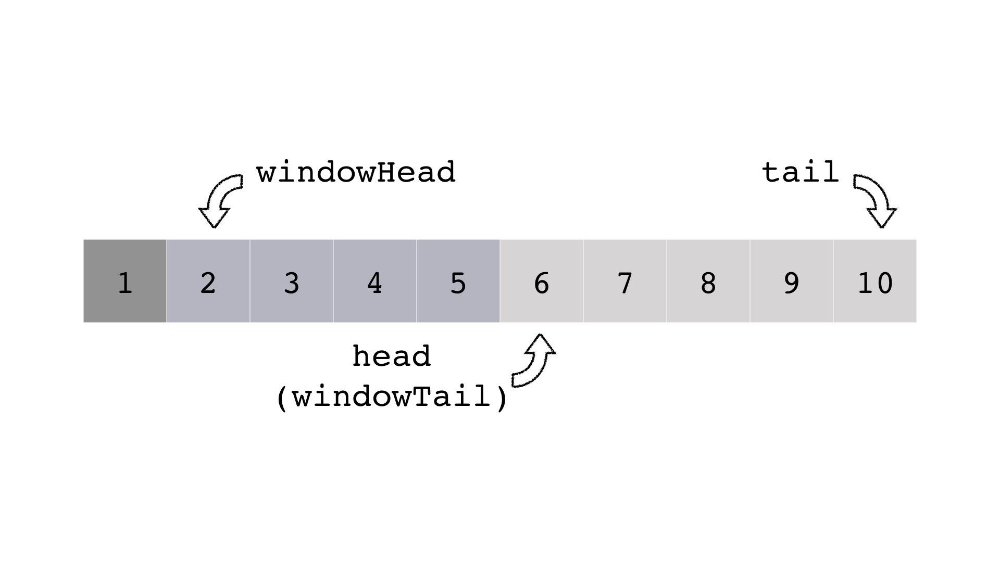
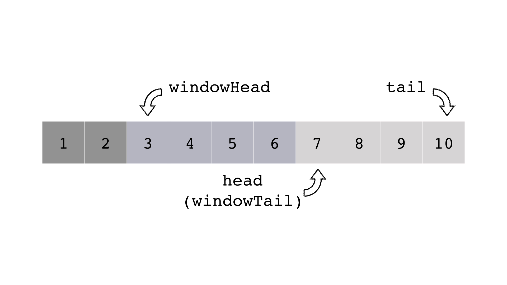

# 计算机网络概论——第一次上机报告

[TOC]

### 停等协议

停等协议的发送队列`sendQueue`采用`STL`中的`queue`方法实现，队列的成员为如下的模板结构体：

```C++
typedef struct buffer
{
	frame data;
	int size;
	buffer(char* data_ = "0", int size_ = 0) : data(*(frame*)data_), size(size_) {};
};
```

其中`frame`为题目中给定的帧字段结构体，`size`为`frame`字段的长度。构造函数`buffer`方便了队列初始化。

在这部分工作中，我遇到了两个比较大的问题。

一开始，我在队列中缓存的是帧的地址（而非帧的内容）。在测试样例中，我依次收到来自同一地址的五个不同的帧，并将它们依次送入发送队列；当我接收到第一帧的ACK后，尝试发送“第二帧地址”处的内容，然而此时该地址处已经存的是第五帧的内容，这导致传输错误。因此，在队列中务必缓存帧的内容。

后来，每当我发送一帧后，就将其`pop`出队。考虑到该帧仍有可能发送超时（而需要重发），若之前就`pop`出队，会导致需重发时找不到该帧。应当等确定该帧发送成功（收到ACK）后再将其pop掉。

### 回退N协议

选择重传协议的基本思路和停等协议相同。然而，选择重传协议会连续发送至多`WINDOW_SIZE_BACK_N_FRAME`帧（这里为4），并可能重传其中连续的某些帧。

如果简单沿用队列的数据结构，一方面，发送时需`pop`至多4帧；另一方面，发送超时后需要找回被`pop`的帧：这超出了队列的能力范围。如果采用“一个队列表示窗口，另一个表示发送队列”的模式，又需要维护太多指针，并带来数据同步和冗余的问题。因此我们考虑如下的数据结构：



这是一个具有三个指针的队列；事实上，它由两个首尾衔接的队列构成。上二图中，最左边的深灰色代表已经成功发送的帧，中部的蓝灰色代表滑动窗口中的帧，而最右边的浅灰色代表排队等待发送的帧。

一方面，考虑发送帧的情况。例如在图一中，我们希望发送第6帧，则把第6帧从等待队列中（队首）取出，放进窗口队列（队尾）。这说明，两个队列的首尾指针可以合成同一个。

另一方面，考虑收到ACK的情况。在图一中，我们如果收到第2帧的ACK，则只需将滑动窗口后移一个单位，并尝试发送下一帧（第6帧）。在上述两种情况下，必须判断等待队列是否为空。

最后，考虑发送失败的情况。仍考虑图一的情形，此时只可能是`windowHead`指向的第2帧超时；假设第3帧超时，那么发端至少应该收到第2帧的ACK，根据上一段的讨论，窗口应当后移一个单位。这是矛盾的。所以，只需把从`windowHead`到`head`的帧重发一遍即可。

### 选择重传协议

只有发送失败的处理方法和回退N不同。这里并非通过“超时”来判定发送失败，而是通过“收到的消息”中的`kind`属性是`ack`还是`nak`来判断对应的帧是否正确发送。`kind`变量是一个枚举类型，所以需注意大小端的转换。

确定属性为`nak`后，只需循环遍历发送窗口，找到并重发对应的帧即可。

### 代码及注释

```c++
#include "sysinclude.h"
// #include <winsock2.h>
#include <queue>
#include <iostream>
#include <stdio.h>
using namespace std;

extern void SendFRAMEPacket(unsigned char* pData, unsigned int len);

#define WINDOW_SIZE_STOP_WAIT 1
#define WINDOW_SIZE_BACK_N_FRAME 4

/* 
 * 下面是按照题目给定的帧数据结构，构造出的结构体；我为了队列操作的方便，额外写了一个默认构造函数。
 * 缓存的必须是帧（而非帧的地址）。存地址会带来严重的问题，后发的帧可能冲掉前面的帧。
 */
typedef enum { data, ack, nak } frame_kind;
typedef struct frame_head
{
	frame_kind kind;
	unsigned seq;
	unsigned ack;
	unsigned char data[100];
};
typedef struct frame
{
	frame_head head;
	unsigned size;
};
typedef struct buffer
{
	frame data;
	int size;
	buffer(char* data_ = "0", int size_ = 0) : data(*(frame*)data_), size(size_) {};
};

// 假设输入缓冲区的队列长度为10000
#define QUEUE_MAX_LENGTH 10000


/* 
 * 停等协议
 */
int stud_slide_window_stop_and_wait(char *pBuffer, int bufferSize, UINT8 messageType)
{
	// 这里为了方便，直接用了STL的队列。
	static queue<buffer> sendQueue;
	static int windowNumber = 0;
    
	// 分三种情况讨论，第一种是需要发送一个帧。
	if (messageType == MSG_TYPE_SEND)
	{
		// 使用默认构造函数把pBuffer指向的bufferSize个字节缓存起来，并强制转换为frame格式。
  		// 这里也可以使用memcpy函数，但是在后面的任务里要用到ack和seq号（需用ntoh进行转换）。
		// 那时用memcpy就比较麻烦了。为了统一，我还是使用了结构体的方法。
		buffer tmp(pBuffer, bufferSize);
		sendQueue.push(tmp);

		// 如果窗口数没达到上限（1），开一个新窗口，并发送队列里的第一帧。
		// 发送这一帧不意味着将其pop出队！因为可能超时重发，若pop出去，就找不到这一帧了。
		// 正确的做法是等ACK（RECEIVE）时再出队。
		if (windowNumber < WINDOW_SIZE_STOP_WAIT)
		{
			windowNumber++;
			buffer now = sendQueue.front();
			SendFRAMEPacket((unsigned char*)&now.data, now.size);
		}
	}
    
	// 第二种情况是收到一个ACK。我们不必额外验证ack号。
	// 因为停等协议的发端每次只发一帧，所以收端发回的ACK一定意味着“上一帧正确发送”。
	else if (messageType == MSG_TYPE_RECEIVE)
	{
  		// 确认成功发送一帧，同时关闭一个窗口；根据第一种情况的讨论，需要让一个帧出队。
		windowNumber--;
		sendQueue.pop();
        
        // 此时如果队列里有待发送的帧，将其发送。仍旧是不pop。
		if (!sendQueue.empty())
		{
			windowNumber++;
			buffer now = sendQueue.front();
			SendFRAMEPacket((unsigned char*)&now.data, now.size);
		}
	}
    
    // 第三种情况，超时。
    // 由于之前没pop，故超时帧就是当前队列第一帧，直接重发即可。
	else if (messageType == MSG_TYPE_TIMEOUT)
	{
		buffer now = sendQueue.front();
		SendFRAMEPacket((unsigned char*)&now.data, now.size);
	}
	return 0;
}

/*
 * 回退N帧协议
 */
int stud_slide_window_back_n_frame(char *pBuffer, int bufferSize, UINT8 messageType)
{
    // 根据报告里的讨论，这里要手写队列sendQueue。
    // head和tail分别是缓冲队列的头指针和尾指针。
    // head代表当前队首元素的位置，tail表示下一个入队元素存储的位置。
    // 因此(head == tail)表示队列为空。
    // windowHead表示当前窗口中（已发送）的第一帧，windowTail表示下一个要进入窗口的帧。
    // 注意到windowTail就是head。
	static buffer sendQueue[QUEUE_MAX_LENGTH];
	static int head = 1, tail = 1;
	static int windowHead = 1; 

    // 第一种情况，发送帧。
	if (messageType == MSG_TYPE_SEND)
	{
		buffer tmp(pBuffer, bufferSize);
		sendQueue[tail++] = tmp;
        
        // 窗口未满，发送一帧。
        // 这里前面已经有一帧入队，所以队列一定非空，不必额外检查。
		if (head - windowHead < WINDOW_SIZE_BACK_N_FRAME)
		{
			buffer now = sendQueue[head++];
			SendFRAMEPacket((unsigned char*)&now.data, now.size);
		}
	}
    
    // 第二种情况，接收帧。
	else if (messageType == MSG_TYPE_RECEIVE)
	{
		buffer tmp(pBuffer, bufferSize);
        
        // 由于使用累计确认，因此将窗口一直往后滑，直到找到ack对应的那帧。
        // 那一帧之前的所有帧，都正确发送了。
		while (head - windowHead > 0 
               && sendQueue[windowHead].data.head.seq != tmp.data.head.ack)
		{
			windowHead++;
            
            // 每滑一次窗口，都要从队列头取出并发送新的一帧。这里必须判断队列是否空。
			if (head < tail)
			{
				buffer now = sendQueue[head++];
				SendFRAMEPacket((unsigned char*)&now.data, now.size);
			}
		}
        
        // 现在windowHead指向正确发送的最后一帧。
        // 但那一帧本身也正确发送了，因此需要再滑一次
		windowHead++;
		if (head < tail)
		{
			buffer now = sendQueue[head++];
			SendFRAMEPacket((unsigned char*)&now.data, now.size);
		}
	}
    
    // 第三种情况，超时。
	else if (messageType == MSG_TYPE_TIMEOUT)
	{
        // 从第二种情况得知，一旦超时，则windowHead指向“未正确发送的第一帧”。
        // 因此将该帧及之后窗口里的所有帧重发。
		for (int i = windowHead; i < head; i++)
		{
			buffer now = sendQueue[i];
			SendFRAMEPacket((unsigned char*)&now.data, now.size);
		}
	}
	return 0;
}

/*
 * 选择重传协议
 */
int stud_slide_window_choice_frame_resend(char *pBuffer, int bufferSize, UINT8 messageType)
{
    // 和回退N协议一样
	static buffer sendQueue[QUEUE_MAX_LENGTH];
	static int head = 1, tail = 1;
	static int windowHead = 1; 

	if (messageType == MSG_TYPE_SEND)
	{
		buffer tmp(pBuffer, bufferSize);
		sendQueue[tail++] = tmp;

		if (head - windowHead < WINDOW_SIZE_BACK_N_FRAME)
		{
			buffer now = sendQueue[head++];
			SendFRAMEPacket((unsigned char*)&now.data, now.size);
		}
	}
    
    // 这里没有超时，只有“收到”的ACK/NAK。分情况讨论。
	else if (messageType == MSG_TYPE_RECEIVE)
	{
		buffer tmp(pBuffer, bufferSize);
        
        // 第一种情况，ACK。（kind变量是一个枚举类型，所以务必注意大小端！）
		if (ntohl(tmp.data.head.kind) == ack)
		{
            // 和回退N协议一样。
			while (head - windowHead > 0 && sendQueue[windowHead].data.head.seq != tmp.data.head.ack)
			{
				windowHead++;
				if (head < tail)
				{
					buffer now = sendQueue[head++];
					SendFRAMEPacket((unsigned char*)&now.data, now.size);
				}
			}
			windowHead++;
			if (head < tail)
			{
				buffer now = sendQueue[head++];
				SendFRAMEPacket((unsigned char*)&now.data, now.size);
			}
		}
        
        // 第二种情况，NAK。
		else
		{
			for (int i = windowHead; i < head; i++)
			{
				buffer now = sendQueue[i];
                // 遍历并找到nak对应的帧序号，重发该帧。
                // 这里两个变量都是network格式，就不必调用ntoh了。
				if (now.data.head.seq == tmp.data.head.ack)
				{
					SendFRAMEPacket((unsigned char*)&now.data, now.size);
					break;
				}
			}
		}
	}
	return 0;
}
```

